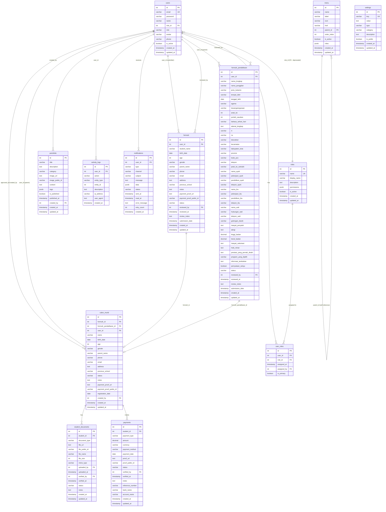
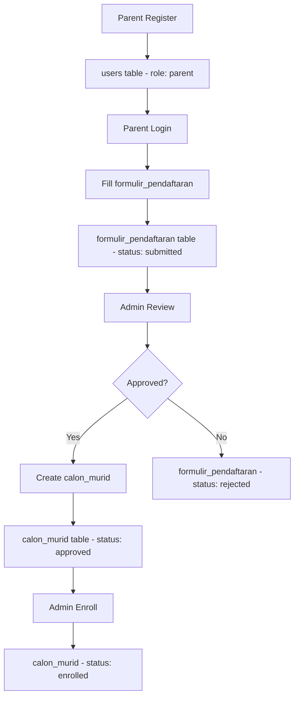
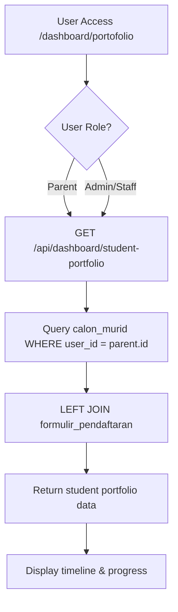
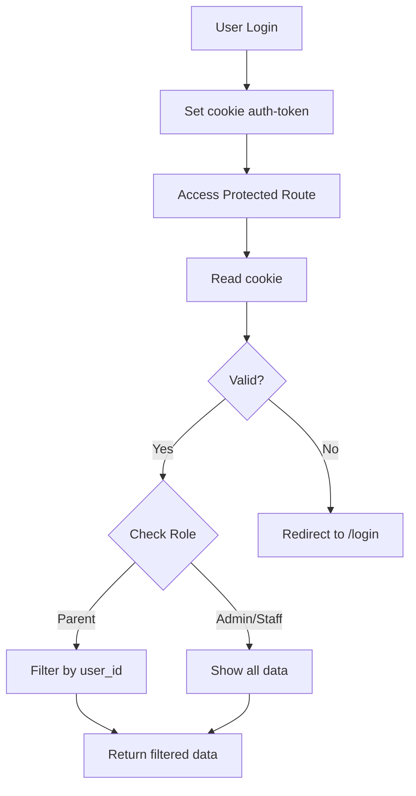

# Database ERD - Iqrolife System

## Entity Relationship Diagram



## Table Relationships

### 1. users (Core Table)
**Purpose:** Menyimpan data user (admin, staff, teacher, parent)

**Relationships:**
- `users` → `calon_murid` (approved_by, created_by, user_id)
- `users` → `formulir` (user_id, reviewed_by)
- `users` → `formulir_pendaftaran` (user_id, reviewed_by)
- `users` → `portofolio` (created_by)
- `users` → `activity_logs` (user_id)

**Key Columns:**
- `role`: superadmin, staff, teacher, parent
- `is_active`: Status aktif user

---

### 2. roles
**Purpose:** Menyimpan role dan permissions (configuration table)

**Relationships:**
- `roles` ← `users` (role_id: **FOREIGN KEY** ✅)

**Key Columns:**
- `name`: Role identifier (superadmin, staff, teacher, parent)
- `permissions`: JSONB untuk flexible permission structure

**How it works:**
```sql
-- NEW: Using FK relationship
SELECT u.*, r.name as role_name, r.permissions
FROM users u
LEFT JOIN roles r ON u.role_id = r.id
WHERE u.id = 1;

-- OLD: Using string matching (deprecated)
SELECT u.*, r.permissions
FROM users u
LEFT JOIN roles r ON u.role = r.name
WHERE u.id = 1;
```

**Migration Status:**
- ✅ **NEW:** `users.role_id` → `roles.id` (FK constraint)
- ⚠️ **OLD:** `users.role` (VARCHAR, kept for backward compatibility)
- 🎯 **Future:** Drop `users.role` column after full migration

---

### 3. calon_murid (Approved Students)
**Purpose:** Data calon murid yang sudah diproses/disetujui admin

**Relationships:**
- `calon_murid` ← `users` (user_id: parent)
- `calon_murid` ← `users` (created_by: admin)
- `calon_murid` ← `formulir` (formulir_id: optional)
- `calon_murid` ← `formulir_pendaftaran` (formulir_pendaftaran_id: optional)

**Key Columns:**
- `user_id`: Link ke parent user (NEW - added via migration)
- `formulir_pendaftaran_id`: Link ke formulir baru (NEW - added via migration)
- `status`: pending, approved, rejected, enrolled

**Flow:**
```
Parent submit form → Admin review → Admin create calon_murid
```

---

### 4. formulir (Old Form System)
**Purpose:** Formulir pendaftaran lama (deprecated, diganti formulir_pendaftaran)

**Relationships:**
- `formulir` ← `users` (user_id: parent submitter)
- `formulir` ← `users` (reviewed_by: admin reviewer)
- `formulir` → `calon_murid` (formulir_id)

**Status:** Legacy table, masih digunakan untuk backward compatibility

---

### 5. formulir_pendaftaran (New Form System)
**Purpose:** Formulir pendaftaran lengkap dengan 5 steps

**Relationships:**
- `formulir_pendaftaran` ← `users` (user_id: parent)
- `formulir_pendaftaran` ← `users` (reviewed_by: admin)
- `formulir_pendaftaran` → `calon_murid` (formulir_pendaftaran_id)

**Key Columns:**
- `program_yang_dipilih`: KBTK, Kelas Eksplorasi, dll
- `status`: draft, submitted, pending, reviewed, approved, rejected, enrolled

**Steps:**
1. Data Pribadi
2. Keterangan Tempat Tinggal
3. Data Orang Tua/Wali
4. Data Kesehatan & Lainnya
5. Pernyataan & Konfirmasi

---

### 6. menu
**Purpose:** Konfigurasi menu navigasi

**Relationships:**
- `menu` → `menu` (parent_id: self-reference untuk submenu)

**Key Columns:**
- `roles`: JSONB array untuk role-based menu access
- `parent_id`: NULL untuk main menu, ID untuk submenu

---

### 7. portofolio (CMS Content)
**Purpose:** Content management untuk artikel/kegiatan sekolah

**Relationships:**
- `portofolio` ← `users` (created_by)

**Note:** ⚠️ Berbeda dengan "student portfolio"! Ini untuk CMS content.

---

### 8. settings
**Purpose:** Konfigurasi aplikasi

**Relationships:** None (standalone configuration table)

**Key Columns:**
- `key`: Unique identifier
- `type`: string, number, boolean, json
- `is_public`: Apakah bisa diakses public

---

### 9. activity_logs
**Purpose:** Log aktivitas user untuk audit trail

**Relationships:**
- `activity_logs` ← `users` (user_id)

**Key Columns:**
- `action`: LOGIN, CREATE, UPDATE, DELETE, etc.
- `entity_type`: users, calon_murid, formulir, etc.
- `entity_id`: ID dari entity yang diakses

---

## Data Flow Diagrams

### Student Registration Flow



### Portfolio Page Data Flow



### Access Control Flow



---

## Key Insights

### 1. Dual Form System
- **Old:** `formulir` table (simple, deprecated)
- **New:** `formulir_pendaftaran` table (complete, 5 steps)
- Both can create `calon_murid` records

### 2. User-Child Mapping
- **Before migration:** No direct link
- **After migration:** `calon_murid.user_id` → `users.id`
- **Benefit:** Role-based access control

### 3. Portfolio Confusion
- **CMS Portfolio:** `portofolio` table (articles, events)
- **Student Portfolio:** Data from `calon_murid` + `formulir_pendaftaran`
- **Different purposes!**

### 4. Status Flow
```
formulir_pendaftaran: draft → submitted → reviewed → approved → enrolled
                                                    ↓
                                                rejected

calon_murid: pending → approved → enrolled
                    ↓
                rejected
```

### 5. Audit Trail
- All user actions logged in `activity_logs`
- Includes IP address and user agent
- Useful for security and compliance

---

## Database Statistics

**Total Tables:** 9
- Core: users, roles
- Students: calon_murid, formulir, formulir_pendaftaran
- System: menu, portofolio, settings, activity_logs

**Total Relationships:** 15+ foreign keys

**Indexes:** 30+ for query optimization

**Triggers:** 7 auto-update timestamp triggers

---

## Migration History

### Recent Migrations
1. ✅ Add `enrolled` status to `formulir_pendaftaran`
2. ✅ Add `user_id` to `calon_murid`
3. ✅ Add `formulir_pendaftaran_id` to `calon_murid`

### Pending Improvements
- [ ] Add `approved_by` and `approved_at` to `calon_murid`
- [ ] Add document tracking table
- [ ] Add payment tracking table
- [ ] Deprecate old `formulir` table

---

## Summary

✅ **Well-structured database** with clear relationships
✅ **Role-based access control** via user_id mapping
✅ **Audit trail** via activity_logs
✅ **Flexible permissions** via JSONB
✅ **Auto-timestamps** via triggers

⚠️ **Areas for improvement:**
- Consolidate dual form system
- Add document management
- Add payment tracking
- Better naming conventions (avoid confusion)

🎉 **Database ready for production!**
