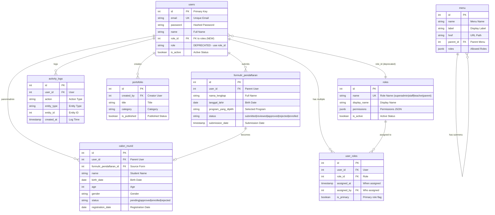
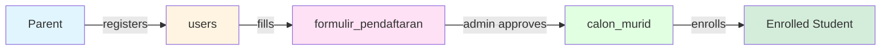
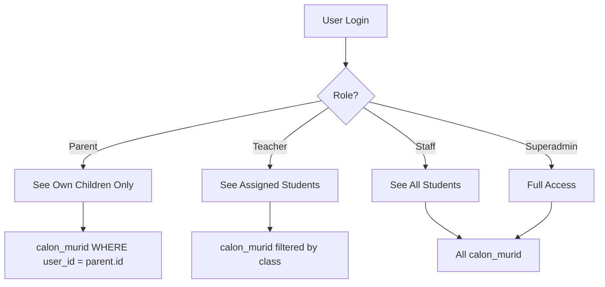

# Database ERD - Simplified Version

## Main Entity Relationship Diagram



## Simplified Data Flow

### 1. Student Registration Process



### 2. Role-Based Access



### 3. Portfolio Page Data Source

```mermaid
flowchart LR
    A[/dashboard/portofolio] --> B[API: student-portfolio]
    B --> C[Query: calon_murid]
    C --> D[JOIN: formulir_pendaftaran]
    D --> E[Return: Student Portfolio Data]
    
    style A fill:#e1f5ff
    style C fill:#e1ffe1
    style D fill:#ffe1f5
    style E fill:#fff4e1
```

## Table Purposes

| Table | Purpose | Used By |
|-------|---------|---------|
| **users** | User accounts | All roles |
| **roles** | Role definitions | System |
| **user_roles** | User-Role assignments (Many-to-Many) | System |
| **calon_murid** | Approved students | Admin, Staff, Parent |
| **formulir_pendaftaran** | Registration forms | Parent (submit), Admin (review) |
| **menu** | Navigation config | System |
| **portofolio** | CMS content | Admin, Staff |
| **settings** | App config | System |
| **activity_logs** | Audit trail | System |

## Key Relationships

### Parent → Children
```
users (parent)
  ↓ user_id
calon_murid (children)
```

### Form → Student
```
formulir_pendaftaran (form)
  ↓ formulir_pendaftaran_id
calon_murid (approved student)
```

### User → Actions
```
users
  ↓ user_id
activity_logs (all actions)
```

## Status Flow

### formulir_pendaftaran
```
draft → submitted → reviewed → approved → enrolled
                              ↓
                          rejected
```

### calon_murid
```
pending → approved → enrolled
        ↓
    rejected
```

## Important Notes

### 🔗 users ↔ roles Relationship

**✅ Foreign Key Added!** (Migration completed: 2024-11-29)

```sql
-- NEW: Using FK relationship
users.role_id → roles.id (FK constraint)
```

**Migration Status:**
- ✅ **NEW:** `users.role_id` INTEGER FK to `roles.id`
- ⚠️ **OLD:** `users.role` VARCHAR (kept for backward compatibility)
- 🎯 **Future:** Drop `users.role` after full code migration

**How to get permissions:**
```sql
-- NEW way (preferred)
SELECT u.*, r.name as role_name, r.permissions
FROM users u
LEFT JOIN roles r ON u.role_id = r.id
WHERE u.id = :user_id;

-- OLD way (deprecated)
SELECT u.*, r.permissions
FROM users u
LEFT JOIN roles r ON u.role = r.name
WHERE u.id = :user_id;
```

**Benefits:**
- ✅ Referential integrity enforced
- ✅ Can't insert invalid role_id
- ✅ Cascade protection (ON DELETE RESTRICT)
- ✅ Better data consistency

---

### ⚠️ Two Different "Portfolio" Concepts

1. **CMS Portfolio** (`portofolio` table)
   - Articles, events, school activities
   - For public website
   - Created by admin/staff

2. **Student Portfolio** (from `calon_murid`)
   - Student registration data
   - Timeline and progress
   - For parent dashboard

### ✅ User-Child Mapping

**Before Migration:**
```
users ❌ calon_murid
(no direct link)
```

**After Migration:**
```
users ✅ calon_murid
(via user_id foreign key)
```

### 🔐 Access Control

**Parent Role:**
- Can only see their own children
- Filter: `WHERE user_id = parent.id`

**Admin/Staff Role:**
- Can see all students
- No filter applied

## Quick Reference

### Get Parent's Children
```sql
SELECT * FROM calon_murid 
WHERE user_id = :parent_user_id;
```

### Get Student with Form Data
```sql
SELECT cm.*, fp.program_yang_dipilih, fp.hobi_minat
FROM calon_murid cm
LEFT JOIN formulir_pendaftaran fp 
  ON cm.formulir_pendaftaran_id = fp.id
WHERE cm.id = :student_id;
```

### Get User Activity
```sql
SELECT * FROM activity_logs
WHERE user_id = :user_id
ORDER BY created_at DESC;
```

## Summary

✅ **9 Tables** with clear relationships
✅ **Role-based access** via user_id mapping
✅ **Audit trail** via activity_logs
✅ **Flexible structure** with JSONB fields

🎯 **Main Flow:** Parent → Form → Admin Review → Approved Student → Enrolled

📊 **Data Source for Portfolio Page:** `calon_murid` (approved students only)
