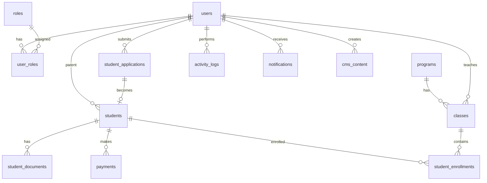

# Database Insights & Long-term Recommendations

## Current State Analysis

### ✅ What's Good

1. **Proper Relationships**
   - ✅ FK constraints implemented
   - ✅ Many-to-many via junction tables
   - ✅ Cascade rules defined
   - ✅ Indexes for performance

2. **Audit Trail**
   - ✅ `activity_logs` table
   - ✅ `created_at` / `updated_at` timestamps
   - ✅ `created_by` / `reviewed_by` tracking

3. **Flexibility**
   - ✅ JSONB for permissions
   - ✅ JSONB for tags/roles
   - ✅ Multiple roles support

4. **Data Integrity**
   - ✅ NOT NULL constraints
   - ✅ UNIQUE constraints
   - ✅ CHECK constraints
   - ✅ Foreign keys

---

## ⚠️ Issues & Technical Debt

### 1. Dual Form System (High Priority)

**Problem:**
```
formulir (old) ←→ calon_murid
formulir_pendaftaran (new) ←→ calon_murid
```

**Issues:**
- Confusing for developers
- Duplicate logic in code
- Data inconsistency risk
- Maintenance overhead

**Recommendation:**
```sql
-- Phase out 'formulir' table
-- Keep only 'formulir_pendaftaran'

-- Migration plan:
1. Migrate all data from formulir → formulir_pendaftaran
2. Update calon_murid.formulir_id → formulir_pendaftaran_id
3. Drop formulir table
4. Rename formulir_pendaftaran → student_applications
```

**Timeline:** 3-6 months

---

### 2. Naming Inconsistency (Medium Priority)

**Problem:**
- Mix of English and Indonesian
- Inconsistent naming patterns
- Confusing table purposes

**Examples:**
```
❌ calon_murid (Indonesian)
✅ student_applications (English)

❌ formulir_pendaftaran (Indonesian)
✅ registration_forms (English)

❌ portofolio (confusing - CMS vs Student)
✅ cms_content + student_portfolios (clear)
```

**Recommendation:**
```sql
-- Standardize to English
ALTER TABLE calon_murid RENAME TO students;
ALTER TABLE formulir_pendaftaran RENAME TO student_applications;
ALTER TABLE portofolio RENAME TO cms_content;

-- Or keep Indonesian but be consistent
ALTER TABLE users RENAME TO pengguna;
ALTER TABLE roles RENAME TO peran;
```

**Timeline:** 6-12 months (breaking change)

---

### 3. Missing Tables (High Priority)

#### A. Documents Management

**Current:** No document tracking
**Need:** Track uploaded documents per student

```sql
CREATE TABLE student_documents (
  id SERIAL PRIMARY KEY,
  student_id INTEGER NOT NULL REFERENCES students(id) ON DELETE CASCADE,
  document_type VARCHAR(50) NOT NULL, -- birth_cert, health_cert, photo, etc.
  file_url TEXT NOT NULL,
  file_public_id VARCHAR(255),
  file_name VARCHAR(255),
  file_size INTEGER,
  mime_type VARCHAR(100),
  uploaded_by INTEGER REFERENCES users(id),
  uploaded_at TIMESTAMP NOT NULL DEFAULT CURRENT_TIMESTAMP,
  verified_by INTEGER REFERENCES users(id),
  verified_at TIMESTAMP,
  status VARCHAR(50) DEFAULT 'pending', -- pending, approved, rejected
  notes TEXT,
  
  CONSTRAINT unique_student_document_type UNIQUE (student_id, document_type)
);
```

**Benefits:**
- Track all documents in one place
- Verification workflow
- File metadata
- Audit trail

---

#### B. Payment Management

**Current:** Only `payment_proof_url` in calon_murid
**Need:** Proper payment tracking

```sql
CREATE TABLE payments (
  id SERIAL PRIMARY KEY,
  student_id INTEGER NOT NULL REFERENCES students(id) ON DELETE CASCADE,
  payment_type VARCHAR(50) NOT NULL, -- registration, tuition, etc.
  amount DECIMAL(12,2) NOT NULL,
  currency VARCHAR(3) DEFAULT 'IDR',
  payment_method VARCHAR(50), -- transfer, cash, etc.
  payment_date DATE,
  proof_url TEXT,
  proof_public_id VARCHAR(255),
  status VARCHAR(50) DEFAULT 'pending', -- pending, verified, rejected
  verified_by INTEGER REFERENCES users(id),
  verified_at TIMESTAMP,
  notes TEXT,
  created_at TIMESTAMP NOT NULL DEFAULT CURRENT_TIMESTAMP,
  updated_at TIMESTAMP NOT NULL DEFAULT CURRENT_TIMESTAMP
);

CREATE INDEX idx_payments_student_id ON payments(student_id);
CREATE INDEX idx_payments_status ON payments(status);
```

**Benefits:**
- Multiple payments per student
- Payment history
- Financial reporting
- Verification workflow

---

#### C. Classes/Programs Management

**Current:** `program_yang_dipilih` as VARCHAR
**Need:** Proper program/class structure

```sql
CREATE TABLE programs (
  id SERIAL PRIMARY KEY,
  name VARCHAR(100) NOT NULL,
  display_name VARCHAR(255) NOT NULL,
  description TEXT,
  age_min INTEGER,
  age_max INTEGER,
  capacity INTEGER,
  tuition_fee DECIMAL(12,2),
  is_active BOOLEAN DEFAULT true,
  created_at TIMESTAMP NOT NULL DEFAULT CURRENT_TIMESTAMP,
  updated_at TIMESTAMP NOT NULL DEFAULT CURRENT_TIMESTAMP
);

CREATE TABLE classes (
  id SERIAL PRIMARY KEY,
  program_id INTEGER NOT NULL REFERENCES programs(id),
  name VARCHAR(100) NOT NULL,
  academic_year VARCHAR(20) NOT NULL, -- 2024/2025
  teacher_id INTEGER REFERENCES users(id),
  capacity INTEGER,
  current_enrollment INTEGER DEFAULT 0,
  start_date DATE,
  end_date DATE,
  is_active BOOLEAN DEFAULT true,
  created_at TIMESTAMP NOT NULL DEFAULT CURRENT_TIMESTAMP,
  updated_at TIMESTAMP NOT NULL DEFAULT CURRENT_TIMESTAMP
);

CREATE TABLE student_enrollments (
  id SERIAL PRIMARY KEY,
  student_id INTEGER NOT NULL REFERENCES students(id),
  class_id INTEGER NOT NULL REFERENCES classes(id),
  enrollment_date DATE NOT NULL,
  status VARCHAR(50) DEFAULT 'active', -- active, completed, dropped
  notes TEXT,
  created_at TIMESTAMP NOT NULL DEFAULT CURRENT_TIMESTAMP,
  updated_at TIMESTAMP NOT NULL DEFAULT CURRENT_TIMESTAMP,
  
  CONSTRAINT unique_student_class UNIQUE (student_id, class_id)
);
```

**Benefits:**
- Proper program management
- Class capacity tracking
- Teacher assignment
- Enrollment history

---

#### D. Notifications System

**Current:** No notification tracking
**Need:** Track sent notifications

```sql
CREATE TABLE notifications (
  id SERIAL PRIMARY KEY,
  user_id INTEGER NOT NULL REFERENCES users(id) ON DELETE CASCADE,
  type VARCHAR(50) NOT NULL, -- email, sms, push, in_app
  channel VARCHAR(50) NOT NULL, -- email, whatsapp, etc.
  subject VARCHAR(255),
  message TEXT NOT NULL,
  data JSONB, -- Additional data
  status VARCHAR(50) DEFAULT 'pending', -- pending, sent, failed, read
  sent_at TIMESTAMP,
  read_at TIMESTAMP,
  error_message TEXT,
  created_at TIMESTAMP NOT NULL DEFAULT CURRENT_TIMESTAMP
);

CREATE INDEX idx_notifications_user_id ON notifications(user_id);
CREATE INDEX idx_notifications_status ON notifications(status);
CREATE INDEX idx_notifications_created_at ON notifications(created_at);
```

**Benefits:**
- Track all notifications
- Delivery status
- Read receipts
- Error handling

---

### 4. Soft Delete Pattern (Medium Priority)

**Current:** Hard delete (data permanently removed)
**Recommendation:** Soft delete (mark as deleted)

```sql
-- Add to all main tables
ALTER TABLE students ADD COLUMN deleted_at TIMESTAMP;
ALTER TABLE users ADD COLUMN deleted_at TIMESTAMP;
ALTER TABLE student_applications ADD COLUMN deleted_at TIMESTAMP;

-- Create index
CREATE INDEX idx_students_deleted_at ON students(deleted_at);

-- Update queries to exclude deleted
-- WHERE deleted_at IS NULL
```

**Benefits:**
- Data recovery possible
- Audit trail preserved
- Compliance requirements
- Undo functionality

---

### 5. Partitioning for Scale (Low Priority - Future)

**When:** > 1 million records
**Tables to partition:**
- `activity_logs` (by date)
- `notifications` (by date)
- `student_applications` (by year)

```sql
-- Example: Partition activity_logs by month
CREATE TABLE activity_logs (
  id SERIAL,
  user_id INTEGER,
  action VARCHAR(100),
  created_at TIMESTAMP NOT NULL,
  ...
) PARTITION BY RANGE (created_at);

CREATE TABLE activity_logs_2024_01 
  PARTITION OF activity_logs
  FOR VALUES FROM ('2024-01-01') TO ('2024-02-01');
```

**Benefits:**
- Better query performance
- Easier archiving
- Faster maintenance

---

## 🎯 Recommended Architecture

### Phase 1: Cleanup (0-3 months)

**Priority: HIGH**

1. **Consolidate Form System**
   - [ ] Migrate formulir → formulir_pendaftaran
   - [ ] Drop formulir table
   - [ ] Update all references

2. **Add Missing Tables**
   - [ ] student_documents
   - [ ] payments
   - [ ] notifications

3. **Deprecate Old Columns**
   - [ ] users.role (use user_roles)
   - [ ] users.role_id (use user_roles)
   - [ ] calon_murid.formulir_id (use formulir_pendaftaran_id)

---

### Phase 2: Enhancement (3-6 months)

**Priority: MEDIUM**

1. **Add Program Management**
   - [ ] programs table
   - [ ] classes table
   - [ ] student_enrollments table

2. **Implement Soft Delete**
   - [ ] Add deleted_at columns
   - [ ] Update queries
   - [ ] Add restore functionality

3. **Improve Audit Trail**
   - [ ] Add more tracking fields
   - [ ] Implement change history
   - [ ] Add data versioning

---

### Phase 3: Optimization (6-12 months)

**Priority: LOW**

1. **Naming Standardization**
   - [ ] Choose language (English recommended)
   - [ ] Rename tables consistently
   - [ ] Update all code references

2. **Performance Optimization**
   - [ ] Add missing indexes
   - [ ] Optimize slow queries
   - [ ] Consider partitioning

3. **Advanced Features**
   - [ ] Full-text search
   - [ ] Data archiving
   - [ ] Reporting tables

---

## 📊 Proposed Final ERD



---

## 🔐 Security Recommendations

### 1. Row-Level Security (RLS)

```sql
-- Enable RLS on sensitive tables
ALTER TABLE students ENABLE ROW LEVEL SECURITY;

-- Policy: Parents can only see their own children
CREATE POLICY parent_students_policy ON students
  FOR SELECT
  USING (user_id = current_user_id());

-- Policy: Staff can see all
CREATE POLICY staff_students_policy ON students
  FOR ALL
  USING (current_user_role() IN ('superadmin', 'staff'));
```

### 2. Encryption

```sql
-- Encrypt sensitive data
CREATE EXTENSION IF NOT EXISTS pgcrypto;

-- Store encrypted data
ALTER TABLE students 
  ADD COLUMN phone_encrypted BYTEA;

-- Encrypt on insert
UPDATE students 
SET phone_encrypted = pgp_sym_encrypt(phone, 'encryption_key');
```

### 3. Audit Triggers

```sql
-- Create audit table
CREATE TABLE audit_trail (
  id SERIAL PRIMARY KEY,
  table_name VARCHAR(100),
  record_id INTEGER,
  action VARCHAR(10), -- INSERT, UPDATE, DELETE
  old_data JSONB,
  new_data JSONB,
  changed_by INTEGER REFERENCES users(id),
  changed_at TIMESTAMP DEFAULT CURRENT_TIMESTAMP
);

-- Create trigger function
CREATE OR REPLACE FUNCTION audit_trigger_func()
RETURNS TRIGGER AS $$
BEGIN
  INSERT INTO audit_trail (table_name, record_id, action, old_data, new_data, changed_by)
  VALUES (TG_TABLE_NAME, NEW.id, TG_OP, row_to_json(OLD), row_to_json(NEW), current_user_id());
  RETURN NEW;
END;
$$ LANGUAGE plpgsql;

-- Apply to tables
CREATE TRIGGER students_audit_trigger
  AFTER INSERT OR UPDATE OR DELETE ON students
  FOR EACH ROW EXECUTE FUNCTION audit_trigger_func();
```

---

## 📈 Performance Recommendations

### 1. Missing Indexes

```sql
-- Add composite indexes for common queries
CREATE INDEX idx_students_user_status ON students(user_id, status);
CREATE INDEX idx_applications_user_status ON student_applications(user_id, status);
CREATE INDEX idx_activity_logs_user_action_date ON activity_logs(user_id, action, created_at);

-- Add partial indexes
CREATE INDEX idx_active_students ON students(id) WHERE deleted_at IS NULL;
CREATE INDEX idx_pending_applications ON student_applications(id) WHERE status = 'pending';
```

### 2. Materialized Views

```sql
-- For dashboard statistics
CREATE MATERIALIZED VIEW dashboard_stats AS
SELECT 
  COUNT(*) FILTER (WHERE status = 'enrolled') as total_enrolled,
  COUNT(*) FILTER (WHERE status = 'pending') as total_pending,
  COUNT(*) FILTER (WHERE created_at >= CURRENT_DATE - INTERVAL '30 days') as new_this_month
FROM students;

-- Refresh periodically
REFRESH MATERIALIZED VIEW dashboard_stats;
```

### 3. Query Optimization

```sql
-- Use EXPLAIN ANALYZE to find slow queries
EXPLAIN ANALYZE
SELECT * FROM students WHERE user_id = 1;

-- Add covering indexes
CREATE INDEX idx_students_covering 
  ON students(user_id) 
  INCLUDE (name, status, created_at);
```

---

## 🧪 Testing Recommendations

### 1. Data Integrity Tests

```sql
-- Check orphaned records
SELECT * FROM students 
WHERE user_id NOT IN (SELECT id FROM users);

-- Check invalid statuses
SELECT * FROM students 
WHERE status NOT IN ('pending', 'approved', 'enrolled', 'rejected');

-- Check data consistency
SELECT * FROM students s
LEFT JOIN student_applications sa ON s.formulir_pendaftaran_id = sa.id
WHERE sa.id IS NULL AND s.formulir_pendaftaran_id IS NOT NULL;
```

### 2. Performance Tests

```sql
-- Test query performance
SELECT 
  schemaname,
  tablename,
  pg_size_pretty(pg_total_relation_size(schemaname||'.'||tablename)) AS size
FROM pg_tables
WHERE schemaname = 'public'
ORDER BY pg_total_relation_size(schemaname||'.'||tablename) DESC;
```

---

## 📝 Documentation Recommendations

### 1. Schema Documentation

```sql
-- Add comprehensive comments
COMMENT ON TABLE students IS 'Approved students who have been processed by admin';
COMMENT ON COLUMN students.user_id IS 'Reference to parent user account';
COMMENT ON COLUMN students.status IS 'Current enrollment status: pending, approved, enrolled, rejected';
```

### 2. Migration Scripts

- ✅ Keep all migration scripts
- ✅ Version control
- ✅ Rollback scripts
- ✅ Test on staging first

### 3. API Documentation

- Document all endpoints
- Include example requests/responses
- Document error codes
- Keep OpenAPI/Swagger updated

---

## 🎯 Priority Matrix

| Task | Priority | Impact | Effort | Timeline |
|------|----------|--------|--------|----------|
| Consolidate form system | 🔴 HIGH | High | Medium | 0-3 months |
| Add document management | 🔴 HIGH | High | Low | 0-3 months |
| Add payment tracking | 🔴 HIGH | High | Low | 0-3 months |
| Implement soft delete | 🟡 MEDIUM | Medium | Low | 3-6 months |
| Add program management | 🟡 MEDIUM | High | High | 3-6 months |
| Standardize naming | 🟡 MEDIUM | Low | High | 6-12 months |
| Add RLS | 🟢 LOW | Medium | Medium | 6-12 months |
| Partitioning | 🟢 LOW | Low | High | 12+ months |

---

## 💡 Key Insights

### 1. Current Strengths
- ✅ Good foundation with FK constraints
- ✅ Audit trail in place
- ✅ Flexible permissions system
- ✅ Multiple roles support

### 2. Main Weaknesses
- ⚠️ Dual form system (technical debt)
- ⚠️ Missing document management
- ⚠️ No payment tracking
- ⚠️ Inconsistent naming

### 3. Quick Wins
1. Add student_documents table (1 week)
2. Add payments table (1 week)
3. Add notifications table (1 week)
4. Implement soft delete (2 weeks)

### 4. Long-term Goals
1. Consolidate to single form system (3 months)
2. Add program/class management (3 months)
3. Standardize naming (6 months)
4. Implement RLS (6 months)

---

## 🚀 Conclusion

**Overall Assessment:** 7/10

**Strengths:**
- Solid foundation
- Good relationships
- Audit trail
- Scalable structure

**Areas for Improvement:**
- Technical debt cleanup
- Missing core features
- Naming consistency
- Advanced security

**Recommendation:**
Focus on **Phase 1 (Cleanup)** first - consolidate form system and add missing tables. This will provide immediate value and set foundation for future enhancements.

**Timeline:**
- Phase 1: 0-3 months (HIGH priority)
- Phase 2: 3-6 months (MEDIUM priority)
- Phase 3: 6-12 months (LOW priority)

**ROI:**
- Phase 1: High (fixes technical debt, adds core features)
- Phase 2: Medium (improves functionality)
- Phase 3: Low (nice to have, future-proofing)

🎯 **Start with quick wins, then tackle technical debt systematically!**
