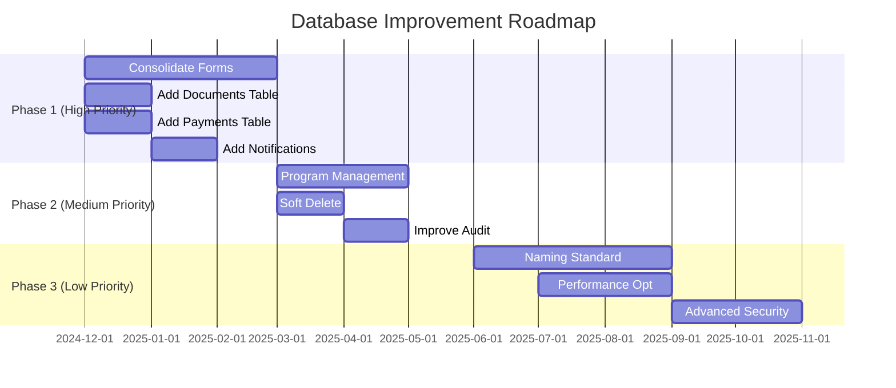

# Database Roadmap - Iqrolife System

## 🎯 Executive Summary

**Current Score:** 7/10
**Main Issues:** Technical debt, missing features, naming inconsistency
**Recommendation:** Focus on cleanup and core features first

---

## 📊 Quick Assessment

### ✅ Strengths (What's Working Well)
- Proper FK relationships
- Audit trail (activity_logs)
- Multiple roles support (user_roles)
- JSONB flexibility
- Auto-timestamps

### ⚠️ Weaknesses (Needs Attention)
- Dual form system (formulir + formulir_pendaftaran)
- No document management
- No payment tracking
- Inconsistent naming (mix English/Indonesian)
- No soft delete

### 🚨 Critical Issues
1. **Technical Debt:** Two form systems causing confusion
2. **Missing Features:** No document/payment tracking
3. **Data Loss Risk:** Hard delete (no recovery)

---

## 🗺️ Roadmap



---

## 🎯 Phase 1: Cleanup & Core Features (0-3 months)

### Priority: 🔴 HIGH

#### 1. Consolidate Form System
**Problem:** Two tables doing same thing
```
❌ formulir (old, deprecated)
❌ formulir_pendaftaran (new, but confusing name)
✅ student_applications (clear, English)
```

**Action:**
- Migrate data from `formulir` → `formulir_pendaftaran`
- Drop `formulir` table
- Rename `formulir_pendaftaran` → `student_applications`

**Impact:** Reduces confusion, easier maintenance
**Effort:** Medium (2-3 months)

---

#### 2. Add Document Management
**Problem:** No way to track uploaded documents

**Solution:**
```sql
CREATE TABLE student_documents (
  id SERIAL PRIMARY KEY,
  student_id INTEGER REFERENCES students(id),
  document_type VARCHAR(50), -- birth_cert, photo, etc.
  file_url TEXT,
  status VARCHAR(50), -- pending, approved, rejected
  uploaded_at TIMESTAMP,
  verified_by INTEGER REFERENCES users(id)
);
```

**Impact:** Proper document tracking, verification workflow
**Effort:** Low (1 week)

---

#### 3. Add Payment Tracking
**Problem:** Only one payment_proof_url, no history

**Solution:**
```sql
CREATE TABLE payments (
  id SERIAL PRIMARY KEY,
  student_id INTEGER REFERENCES students(id),
  amount DECIMAL(12,2),
  payment_type VARCHAR(50), -- registration, tuition
  status VARCHAR(50), -- pending, verified
  payment_date DATE,
  verified_by INTEGER REFERENCES users(id)
);
```

**Impact:** Financial tracking, multiple payments, reporting
**Effort:** Low (1 week)

---

#### 4. Add Notifications
**Problem:** No notification tracking

**Solution:**
```sql
CREATE TABLE notifications (
  id SERIAL PRIMARY KEY,
  user_id INTEGER REFERENCES users(id),
  type VARCHAR(50), -- email, sms, push
  message TEXT,
  status VARCHAR(50), -- sent, read, failed
  sent_at TIMESTAMP
);
```

**Impact:** Track all communications, delivery status
**Effort:** Low (1 week)

---

## 🎯 Phase 2: Enhancement (3-6 months)

### Priority: 🟡 MEDIUM

#### 1. Program & Class Management
**Problem:** `program_yang_dipilih` is just a string

**Solution:**
```sql
CREATE TABLE programs (
  id SERIAL PRIMARY KEY,
  name VARCHAR(100),
  capacity INTEGER,
  tuition_fee DECIMAL(12,2)
);

CREATE TABLE classes (
  id SERIAL PRIMARY KEY,
  program_id INTEGER REFERENCES programs(id),
  teacher_id INTEGER REFERENCES users(id),
  academic_year VARCHAR(20)
);

CREATE TABLE student_enrollments (
  student_id INTEGER REFERENCES students(id),
  class_id INTEGER REFERENCES classes(id),
  enrollment_date DATE
);
```

**Impact:** Proper program management, capacity tracking
**Effort:** High (2-3 months)

---

#### 2. Soft Delete
**Problem:** Deleted data is gone forever

**Solution:**
```sql
ALTER TABLE students ADD COLUMN deleted_at TIMESTAMP;
ALTER TABLE users ADD COLUMN deleted_at TIMESTAMP;

-- Query: WHERE deleted_at IS NULL
```

**Impact:** Data recovery, audit trail, undo functionality
**Effort:** Low (2 weeks)

---

## 🎯 Phase 3: Optimization (6-12 months)

### Priority: 🟢 LOW

#### 1. Naming Standardization
**Problem:** Mix of English and Indonesian

**Options:**
- **Option A:** All English (recommended for international)
- **Option B:** All Indonesian (if local only)

**Example:**
```sql
-- Option A: English
calon_murid → students
formulir_pendaftaran → student_applications
portofolio → cms_content

-- Option B: Indonesian
users → pengguna
roles → peran
```

**Impact:** Consistency, easier for new developers
**Effort:** High (3-6 months, breaking change)

---

#### 2. Performance Optimization
**Actions:**
- Add missing indexes
- Create materialized views for dashboards
- Optimize slow queries
- Consider partitioning for large tables

**Impact:** Faster queries, better UX
**Effort:** Medium (2 months)

---

#### 3. Advanced Security
**Actions:**
- Row-Level Security (RLS)
- Data encryption for sensitive fields
- Comprehensive audit triggers

**Impact:** Better security, compliance
**Effort:** Medium (2 months)

---

## 📋 Quick Wins (Do First!)

### Week 1-2
- [ ] Add `student_documents` table
- [ ] Add `payments` table
- [ ] Add `notifications` table

### Week 3-4
- [ ] Implement soft delete
- [ ] Add missing indexes
- [ ] Document all tables

### Month 2-3
- [ ] Migrate `formulir` → `formulir_pendaftaran`
- [ ] Drop `formulir` table
- [ ] Update all code references

---

## 🎯 Success Metrics

### Phase 1 Success
- ✅ Single form system
- ✅ Document tracking working
- ✅ Payment tracking working
- ✅ No data loss (soft delete)

### Phase 2 Success
- ✅ Program management live
- ✅ Class enrollment working
- ✅ Improved audit trail

### Phase 3 Success
- ✅ Consistent naming
- ✅ Query performance < 100ms
- ✅ RLS implemented

---

## 💰 Cost-Benefit Analysis

| Phase | Cost (Time) | Benefit | ROI |
|-------|-------------|---------|-----|
| Phase 1 | 3 months | High | ⭐⭐⭐⭐⭐ |
| Phase 2 | 3 months | Medium | ⭐⭐⭐⭐ |
| Phase 3 | 6 months | Low | ⭐⭐⭐ |

**Recommendation:** Focus on Phase 1 first!

---

## 🚦 Decision Matrix

### Do Now (Phase 1)
- ✅ High impact, low effort
- ✅ Fixes technical debt
- ✅ Adds core features
- ✅ Quick wins

### Do Later (Phase 2)
- ⏳ Medium impact, medium effort
- ⏳ Nice to have
- ⏳ Can wait 3-6 months

### Do Eventually (Phase 3)
- 🔮 Low impact, high effort
- 🔮 Future-proofing
- 🔮 Can wait 6-12 months

---

## 📞 Next Steps

### Immediate Actions
1. **Review this roadmap** with team
2. **Prioritize** based on business needs
3. **Start with quick wins** (documents, payments)
4. **Plan migration** for form consolidation

### Questions to Answer
- [ ] English or Indonesian naming?
- [ ] When to tackle form consolidation?
- [ ] Budget for Phase 2/3?
- [ ] Timeline flexibility?

---

## 🎓 Key Takeaways

1. **Current system is solid** (7/10) but has technical debt
2. **Quick wins available** - add missing tables (1-2 weeks)
3. **Main issue** - dual form system needs consolidation
4. **Long-term** - standardize naming, optimize performance
5. **Priority** - Phase 1 (cleanup) before Phase 2/3 (enhancement)

---

## 📚 Related Documents

- `DATABASE_INSIGHTS_AND_RECOMMENDATIONS.md` - Detailed analysis
- `DATABASE_ERD.md` - Current ERD
- `DATABASE_ERD_SIMPLE.md` - Simplified ERD
- `MULTIPLE_ROLES_FEATURE.md` - Multiple roles implementation

---

## 🎯 Final Recommendation

**Start with Phase 1 quick wins:**
1. Week 1: Add `student_documents` table ✅
2. Week 2: Add `payments` table ✅
3. Week 3: Add `notifications` table ✅
4. Week 4: Implement soft delete ✅

**Then tackle technical debt:**
5. Month 2-3: Consolidate form system 🔄

**This approach:**
- ✅ Delivers value quickly
- ✅ Reduces risk
- ✅ Builds momentum
- ✅ Sets foundation for future

🚀 **Let's start with quick wins and build from there!**
